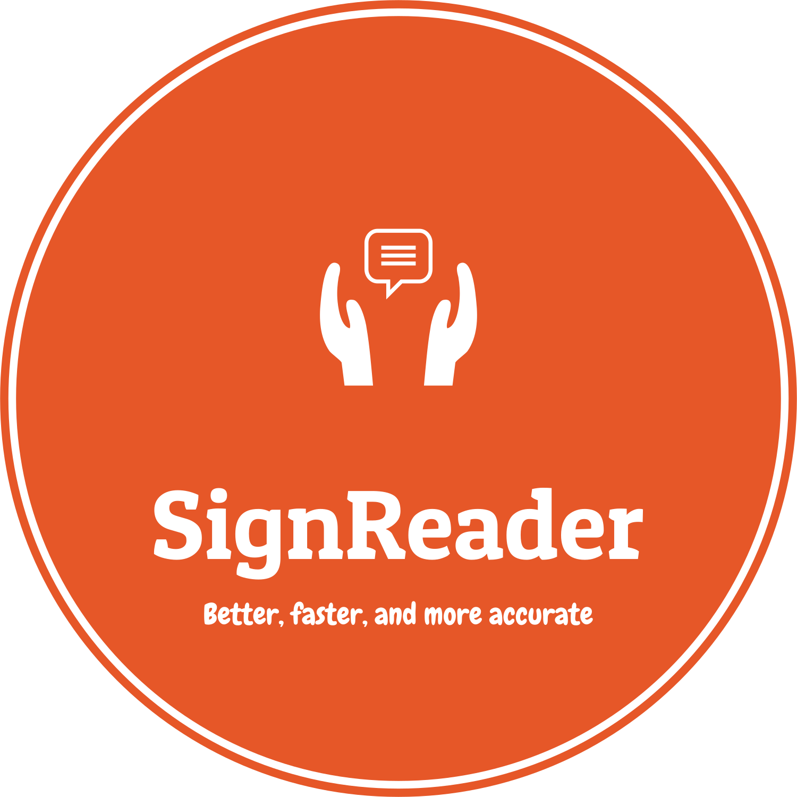

# SignReader — AI 手語辨識的跨領域創新應用

<p align="center">
  
</p>

<p align="center">
  <strong>即時手語辨識 · 互動學習 · 無障礙溝通</strong>
</p>

---

## 獲獎經歷

| 競賽 / 活動 | 獎項 | 時間 |
|------------|------|------|
| **第 29 屆大專校院資訊應用服務創新競賽（InnoServe）** | 教育 AI 組 **第一名** | 2024.11 |
| **第 29 屆大專校院資訊應用服務創新競賽（InnoServe）** | 資訊應用組（IP4） **第二名** | 2024.11 |
| **第 28 屆國際資訊管理暨實務研討會（IMP 2023）** | 論文發表 | 2023.12 |

---

## 展示影片

[](https://www.youtube.com/watch?v=0Yc1tD9It3o)

> 點擊上方圖片觀看完整展示影片

---

## Demo Site

> **線上體驗**：[https://signreader.onrender.com](https://signreader.onrender.com)
>
> *(需要攝影機權限以使用手語辨識功能)*

### 與原始版本的差異

| 項目 | 原始版本（本地端） | Demo Site（Render 部署） |
|------|-------------------|------------------------|
| **MediaPipe 執行端** | Python 後端（伺服器端） | 瀏覽器端 JavaScript |
| **攝影機來源** | `cv2.VideoCapture(0)` 本地攝影機 | `getUserMedia` 瀏覽器前置鏡頭 |
| **影像傳輸** | 本地處理，無需傳輸 | 僅傳送 1662 個關鍵點數值（~13KB），不傳影像 |
| **骨架繪製** | OpenCV 繪製於影像上 | Canvas 2D 繪製（保留原始骨架顏色） |
| **辨識速度** | 即時（~20-30 FPS） | 約 6-7 FPS（節流 150ms，降低伺服器負載） |
| **信心度門檻** | 無 | 60% 以上才算有效辨識 |
| **WebSocket** | 無（本地直接呼叫） | Socket.IO 即時雙向通訊 |
| **部署方式** | 直接執行 `python app.py` | Docker 容器化部署於 Render |

> **注意**：由於雲端部署的網路延遲與 Render 免費方案的資源限制，線上版的辨識反應速度會比本地端稍慢，但核心辨識功能與視覺體驗保持一致。

---

## 專案簡介

**SignReader** 是一套結合 **AI 影像辨識** 與 **互動式學習** 的台灣手語學習系統，透過「影像辨識模組」與「手語影片模組」，為聽障兒童及其周遭利害關係人（家長、教師、同儕）提供即時、有趣且有效的手語學習體驗。

與教育部現有手語學習系統相比，SignReader 在 **使用者滿意度（4.26 vs. 3.51）** 與 **系統品質（4.31 vs. 3.68）** 上均顯著優於傳統學習方式。

---

## 技術架構

### 核心辨識流程

```
瀏覽器攝影機 → MediaPipe Holistic JS（擷取 543 個人體關鍵點）
                    ↓
            關鍵點提取（pose 33×4 + face 468×3 + 左右手各 21×3 = 1662 維）
                    ↓
            Socket.IO WebSocket 傳送至伺服器
                    ↓
            LSTM 深度學習模型（30 幀時間序列辨識）
                    ↓
            即時手語辨識結果 + 信心度回饋
```

### 前端技術

| 技術 | 用途 |
|------|------|
| **MediaPipe Holistic JS** | 瀏覽器端人體姿態、臉部、手部關鍵點偵測與骨架繪製 |
| **Socket.IO Client** | 即時雙向通訊，傳送關鍵點、接收辨識結果 |
| **HTML / CSS / JavaScript** | 頁面結構與互動邏輯 |
| **Bootstrap 5** | 響應式排版 |
| **Vue.js** | 動態互動元件（電子詞彙書等） |

### 後端技術

| 技術 | 用途 |
|------|------|
| **Python / Flask** | Web 伺服器與路由 |
| **Flask-SocketIO + Eventlet** | 非同步 WebSocket 伺服器 |
| **TensorFlow / Keras（LSTM）** | 深度學習手語辨識模型 |
| **NumPy** | 關鍵點數值運算 |
| **Docker** | 容器化部署（Render） |

### LSTM 模型架構

```
LSTM(64, return_sequences=True)
  → LSTM(128, return_sequences=True)
    → LSTM(64, return_sequences=False)
      → Dense(64) → Dense(32) → Dense(N, softmax)
```

每個動作以 **30 幀** 作為一組時間序列輸入，模型透過學習手部動作的時間變化規律進行辨識。連續 **7 幀** 辨識正確（信心度 ≥ 60%）即判定成功。

---

## 功能模組

### 1. 情境練習模組

涵蓋 **八大生活主題**，提供貼近日常的手語學習內容：

| 主題 | 手語詞彙 |
|------|----------|
| 問候語 | 加油、是、不是 |
| 住宿 | 網際網路、沒有、住宿 |
| 用餐 | 麵、豬、飯 |
| 居家 | 燈、盤子、電話 |
| 交通 | 右轉、開車、晚上 |
| 醫療 | 藥、還有、檢查 |
| 溝通 | 聯絡、現在、資料 |
| 購物 | 錢、哪裡、信用卡 |

### 2. 即時辨識模組

透過瀏覽器端 MediaPipe Holistic 擷取使用者全身關鍵點，經 Socket.IO 傳送至伺服器，結合 LSTM 模型進行動作辨識。提供：
- **即時骨架視覺化** — 臉部輪廓、身體姿態、左右手骨架
- **信心度長條圖** — 各詞彙的即時辨識機率
- **比錯回饋** — 顯示「你比的是 X，目標是 Y」並提供參考圖片
- **示範影片** — 可查看正確手語動作的教學影片

### 3. 電子詞彙語句功能

使用者可透過點擊文字組件組合語句，系統即時轉換為對應的手語影片，幫助聽障家庭進行日常溝通。內含 **224 個手語教學影片**。

---

## 開發過程中遇到的困難

### 1. 資料集收集 — 親自錄製
市面上缺乏可直接使用的台灣手語動作資料集，因此所有訓練資料皆由團隊成員**親自錄製**。每個手語動作需錄製多次、多角度的影片，再透過 MediaPipe 擷取關鍵點轉換為訓練數據，過程耗時且需反覆確認動作標準性。

### 2. 模型訓練與調校
LSTM 模型需要大量時間序列資料才能有效辨識手語動作。訓練過程中面臨：
- 部分動作相似度高，容易混淆（如「是」與「加油」）
- 需反覆調整模型超參數（層數、神經元數量、學習率）
- 訓練時間長，每次調整都需重新訓練驗證

### 3. 瀏覽器端 MediaPipe 架構轉換
原始系統使用 Python 端的 MediaPipe 進行影像處理，部署至雲端後需改為瀏覽器端 JavaScript 版本。轉換過程中需確保：
- 關鍵點提取順序與維度（1662 維）完全一致
- 骨架繪製顏色與樣式還原（BGR → RGB 色彩轉換）
- 節流控制避免伺服器過載（150ms 間隔，~6-7 FPS）

### 4. 套件版本衝突
部署環境中 `tensorflow`、`mediapipe`、`keras` 等套件的版本相容性問題頻繁出現：
- `tensorflow-cpu` 與 `keras` 需使用 TensorFlow 內建版本，不能安裝獨立 `keras` 套件
- Render 部署環境的記憶體限制需使用 `tensorflow-cpu` 而非完整版
- `flask-socketio` 的 `request` 物件取用方式在不同版本間有差異

### 5. 即時辨識延遲控制
雲端部署後，網路延遲與伺服器運算時間的疊加導致辨識反應變慢：
- 加入 60% 信心度門檻，避免誤判
- 客戶端節流（150ms）平衡辨識頻率與伺服器負載
- 連續 7 幀正確才判定成功，防止偶發誤判

---

## 快速開始

### 環境需求
- Python 3.10+
- 攝影機裝置（筆電內建或外接 USB 攝影機）

### 安裝與執行

```bash
# 1. Clone 專案
git clone https://github.com/sembeiiiii/Signreader.git
cd Signreader

# 2. 安裝 Python 套件
pip install -r requirements.txt

# 3. 啟動伺服器
python app.py
```

伺服器啟動後，開啟瀏覽器前往 `http://localhost:5500` 即可使用。

---

## 專案結構

```
SignReader/
├── app.py                  # Flask + Socket.IO 主應用程式
├── utils.py                # 手語辨識核心邏輯（關鍵點處理 + LSTM 推論）
├── requirements.txt        # Python 套件依賴
├── Dockerfile              # Docker 容器化部署設定
├── templates/              # HTML 頁面模板
│   ├── page.html           # 首頁
│   ├── home.html           # 主選單
│   ├── card.html           # 主題卡片
│   ├── cardTest.html       # 辨識測驗選擇頁
│   └── recognize.html      # 即時辨識頁面（MediaPipe + Canvas）
├── static/
│   ├── recognize.js        # 瀏覽器端 MediaPipe 辨識邏輯
│   ├── imgs/               # 圖片資源（手語參考圖）
│   ├── videos/             # 手語教學影片（224 個）
│   ├── model/latest/       # LSTM 預訓練模型（.h5）
│   ├── *.js                # 前端 JavaScript（book.js, card.js 等）
│   └── bootstrap.min.*     # Bootstrap 框架
└── gensen-font-master/     # 中文字型（源泉圓體）
```

---

## 團隊成員

| 學號 | 姓名 | 角色 |
|------|------|------|
| U1033021 | 王宥翔 | 專題組長 |
| U0933004 | 周鈺庭 | 專題組員 |
| U1033015 | 林仙安 | 專題組員 |
| U1033028 | 謝獻堂 | 專題組員 |
| U1033030 | 周忠彥 | 專題組員 |
| U1033055 | 陳如筠 | 專題組員 |

**指導教授**：黃品叡

---

## 授權

本專案僅供學術研究與教育用途。
